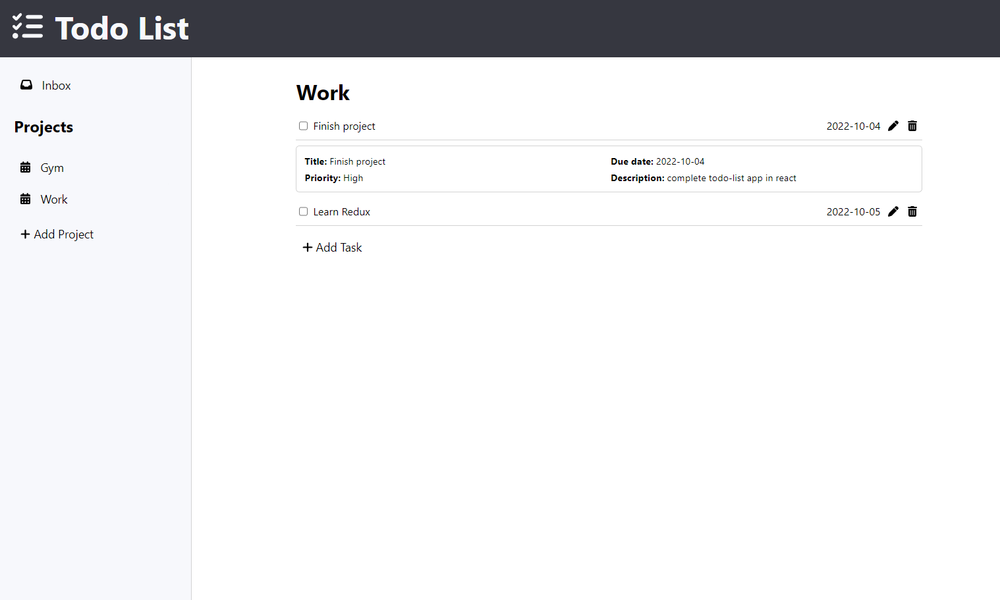

# Todo List App

Todo list app built with react. Previously done with pure JS ([See here](https://github.com/kmatic/todo-list)). See a preview of the application below.

## Demo

[Live Demo](https://kmatic.github.io/todo-list-react)

## Built With

- [React](https://reactjs.org/)
- [styled-components](https://styled-components.com/)
- [uuid](https://www.npmjs.com/package/uuid)
- [Redux Toolkit](https://redux-toolkit.js.org/)
- [React-Redux](https://react-redux.js.org/)
- [Firebase](https://firebase.google.com/) (Auth & Firestore)

## Skills learned/improved

- Handling react state
- Structuring of react applications for data-flow
- CSS (styled-components)
- Redux/Redux-toolkit + React-Redux 
- Basic understanding of firebase and its various tools

## Reflection

This todo-list app has gone through various iterations from:
- Pure JS
- React w/ component state
- React w/ redux state
- React w/ redux state & incorporating firebase

Going from react using component state to the redux state was not too difficult but anything onwards was a challenge. Trying to integrate firebase with redux while only having a basic understanding of redux made it quite difficult. In a future project I would definitely get a better grasp of redux first (thunks, async capabilities, etc) before implementing firebase. My understanding and knowledge is still surface-level but I ended up getting it working to a certain degree (although I believe some of the code is messy). Some features still have to be worked on that were present in a previous iteration but the app now has the ability to fetch todos from a firestore database which it did not before.

## Ideas to Improve

- Fix edit implementation. Firestore does not have functionality to edit objects in an array. A way to go around this is to obtain the whole document and update the array in memory. My current implementation of this is to store a copy of the todo to be edited and once the edited todo has been submitted, delete the old 'unedited' to do by passing in the copy. It works but I feel it could be better
- Display an active project on first load
- Styling (responsive design)
